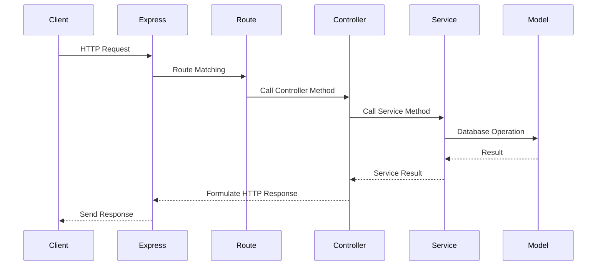
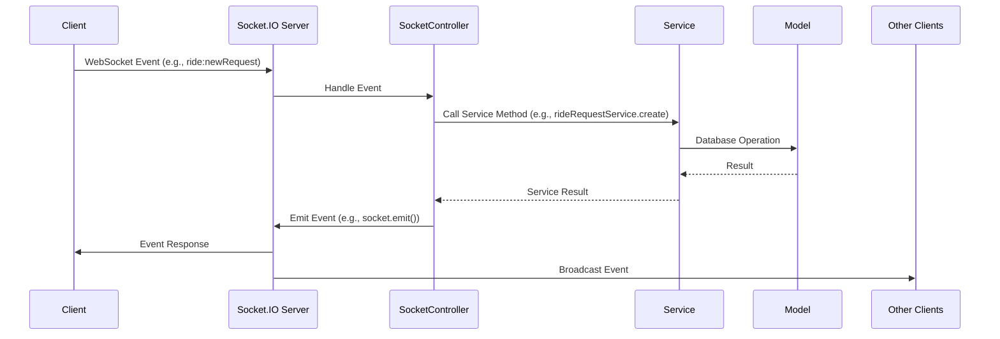

# TrueFare Backend Architecture

## Overview
The TrueFare backend uses a hybrid architecture to handle both HTTP API requests and WebSocket events. This design allows for efficient handling of traditional CRUD operations via HTTP while enabling real-time interactions through WebSockets. The core components are:

- **Models**: Represent data structures and interact with the database.
- **Services**: Contain business logic and are used by both HTTP controllers and WebSocket event handlers.
- **HTTP Controllers**: Handle incoming HTTP requests (via Express routes).
- **WebSocket Event Handlers**: Handle incoming WebSocket events (via Socket.IO).
- **Utilities**: Provide reusable functions and classes (e.g., connection management).

## Directory Structure
```
backend/
  src/
    config/          # Configuration files (e.g., environment variables)
    constants.js     # Shared constant values
    controllers/     # Request handlers for HTTP and WebSocket events
    db/              # Database connection and setup
    middleware/      # Express middleware (e.g., authentication, error handling)
    models/          # Mongoose data models
    routes/          # Express route definitions
    services/        # Core business logic
    utils/           # Reusable utility functions
    validations/     # Zod validation schemas
    app.js           # Express application setup
    index.js         # Main server entry point
```

## Detailed Component Breakdown

### Models
Models are Mongoose schemas that define the structure of documents in MongoDB collections. They are located in `src/models/`.

- **User Model**: Defines user attributes (id, name, phone, etc.).
- **RideRequest Model**: Defines ride request attributes (userId, from, to, status, etc.).
- **Bid Model**: Defines bid attributes (driverId, rideRequestId, amount, status, etc.).

Example: `src/models/rideRequest.model.js`
```javascript
const rideRequestSchema = new mongoose.Schema({
  userId: { type: mongoose.Schema.Types.ObjectId, ref: 'User', required: true },
  from: { type: { lat: Number, lng: Number }, required: true },
  to: { type: { lat: Number, lng: Number }, required: true },
  status: { type: String, enum: ['pending', 'bidding', 'accepted', 'completed', 'cancelled'], default: 'pending' },
  createdAt: { type: Date, default: Date.now }
});
```

### Controllers
Controllers are the primary request handlers, located in `src/controllers/`. They bridge the gap between incoming requests (both HTTP and WebSocket) and the business logic contained in services.

- **HTTP Controllers** (e.g., `auth.controller.js`, `user.controller.js`): Handle requests from Express routes. They process the request, call the appropriate service methods, and formulate the HTTP response.
- **WebSocket Controller** (`socket.controller.js`): Contains all event handlers for the Socket.IO server. It listens for client events, validates data, and uses services to perform actions before emitting responses or broadcasting to rooms.

Example: `src/controllers/socket.controller.js` handling `ride:newRequest`
```javascript
// Inside SocketController.handleUserConnection
socket.on('ride:newRequest', async (data) => {
  try {
    const rideRequest = await rideRequestService.createRideRequest(socket.user.id, data);
    socket.emit('ride:requestCreated', rideRequest);
    socketService.broadcastRideRequest(rideRequest);
  } catch (error) { 
    socket.emit('error', { message: error.message });
  }
});
```

### Services
Services contain the core business logic and are located in `src/services/`. They are used by controllers to interact with data models and perform complex operations.

- **socketService.js**: Manages WebSocket connections, rooms, and broadcasting. It keeps track of connected users and drivers and provides methods for sending targeted messages and broadcasting to rooms.
- **rideRequest.service.js**: Contains business logic related to ride requests, such as creation, finding available rides, and managing their lifecycle.

### HTTP Request Flow


### WebSocket Event Flow


## Real-world Use Cases

### User Registration
1. HTTP POST to `/api/auth/register`.
2. The corresponding route in `src/routes/auth.routes.js` directs the request to the `register` method in `src/controllers/auth.controller.js`.
3. The controller validates the input and uses the `User` model to create a new user.
4. Returns a JWT and the created user data.

### Ride Request Creation
1. A connected user emits a `ride:newRequest` event.
2. The event is handled by the `SocketController`.
3. It calls the `rideRequest.service.js` to create the ride request in the database.
4. The `socketService.js` is then used to broadcast the new request to all drivers in the `drivers` room.

### Bid Placement
1. A connected driver emits a `ride:bidPlaced` event.
2. The `SocketController` handles the event.
3. It uses the `RideRequest` model to find the request and add the new bid.
4. The `socketService.js` sends a targeted `ride:bidUpdate` event to the user who created the ride.

### Ride Acceptance
1. The user emits a `ride:bidAccepted` event.
2. The `SocketController` handles the event.
3. It updates the `RideRequest` and `Bid` status in the database.
4. The `socketService.js` notifies the winning driver and broadcasts that bidding is closed to other drivers.

## Performance Considerations
- **Connection Management**: Efficient tracking of active connections to minimize lookup time.
- **Database Optimization**: Use of indexes and lean queries.
- **Event Batching**: Grouping multiple events to reduce network overhead.
- **Caching**: Frequently accessed data is cached to reduce database load.

## Security Measures
- **Authentication**: JWT tokens for HTTP and WebSocket connections.
- **Authorization**: Role-based access control.
- **Validation**: Input validation using Zod schemas.
- **Encryption**: Sensitive data encrypted at rest and in transit.

## Monitoring and Logging
- **Winston Logger**: Centralized logging with different levels (info, error, debug).
- **Metrics**: Collection of performance metrics (response times, error rates).
- **Alerts**: Notifications for critical errors or performance degradation.

## Future Improvements
- **Scalability**: Introduce Redis for pub/sub to scale WebSocket horizontally.
- **GraphQL**: Implement GraphQL for more flexible data querying.
- **Enhanced Analytics**: Real-time analytics dashboard for monitoring.
- **Microservices**: Split into microservices for better maintainability.