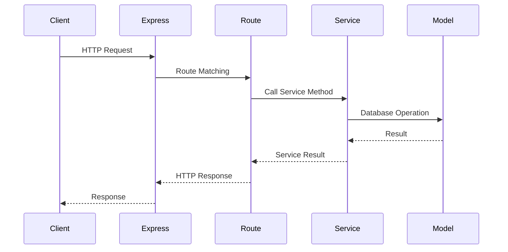
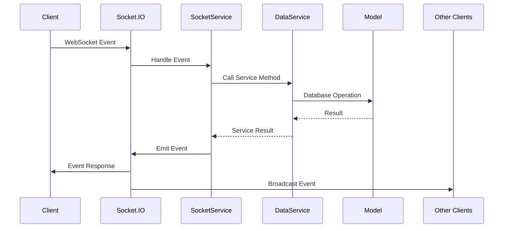

# TrueFare Backend Architecture

## Overview
The TrueFare backend uses a hybrid architecture to handle both HTTP API requests and WebSocket events. This design allows for efficient handling of traditional CRUD operations via HTTP while enabling real-time interactions through WebSockets. The core components are:

- **Models**: Represent data structures and interact with the database.
- **Services**: Contain business logic and are used by both HTTP controllers and WebSocket event handlers.
- **HTTP Controllers**: Handle incoming HTTP requests (via Express routes).
- **WebSocket Event Handlers**: Handle incoming WebSocket events (via Socket.IO).
- **Utilities**: Provide reusable functions and classes (e.g., connection management).

## Directory Structure
```
backend/
  src/
    models/          # Mongoose models (e.g., User, RideRequest, Bid)
    routes/          # Express routes (HTTP API endpoints)
    services/        # Business logic services
    utils/           # Utility functions and classes
    index.js         # Main entry point (sets up Express and WebSocket server)
    socket.js        # WebSocket server setup and event binding
```

## Detailed Component Breakdown

### Models
Models are Mongoose schemas that define the structure of documents in MongoDB collections. They are located in `src/models/`.

- **User Model**: Defines user attributes (id, name, phone, etc.).
- **RideRequest Model**: Defines ride request attributes (userId, from, to, status, etc.).
- **Bid Model**: Defines bid attributes (driverId, rideRequestId, amount, status, etc.).

Example: `src/models/rideRequest.model.js`
```javascript
const rideRequestSchema = new mongoose.Schema({
  userId: { type: mongoose.Schema.Types.ObjectId, ref: 'User', required: true },
  from: { type: { lat: Number, lng: Number }, required: true },
  to: { type: { lat: Number, lng: Number }, required: true },
  status: { type: String, enum: ['pending', 'bidding', 'accepted', 'completed', 'cancelled'], default: 'pending' },
  createdAt: { type: Date, default: Date.now }
});
```

### Services
Services contain the core business logic and are located in `src/services/`. They are used by both HTTP controllers and WebSocket event handlers.

- **DataPersistenceService**: Handles all database operations.
- **SocketService**: Manages WebSocket event handling and broadcasting.
- **AuthService**: Handles authentication and authorization logic.

Example: `src/services/dataPersistenceService.js`
```javascript
class DataPersistenceService {
  async createRideRequest(rideRequestData) {
    const rideRequest = new RideRequest(rideRequestData);
    await rideRequest.save();
    return rideRequest;
  }
}
```

### HTTP Controllers
HTTP controllers are defined in the route files under `src/routes/`. They handle incoming HTTP requests and send responses.

Example: `src/routes/rideRequest.routes.js`
```javascript
router.post('/ride-requests', async (req, res) => {
  try {
    const rideRequest = await dataPersistenceService.createRideRequest(req.body);
    res.status(201).json(rideRequest);
  } catch (error) {
    res.status(500).json({ error: error.message });
  }
});
```

### WebSocket Event Handlers
WebSocket event handlers are located in `src/services/socketService.js`. They handle events like `ride:newRequest`, `ride:bidPlaced`, etc.

Example: Handling `ride:newRequest` event
```javascript
socket.on('ride:newRequest', async (data) => {
  try {
    const rideRequest = await dataPersistenceService.createRideRequest(data);
    // Broadcast to drivers
    socketService.broadcastToDrivers('ride:newRequest', rideRequest);
    // Emit to user
    socket.emit('ride:requestCreated', rideRequest);
  } catch (error) {
    socket.emit('error', { message: error.message });
  }
});
```

### Utilities
Utility modules provide reusable functionality and are located in `src/utils/`.

- **SocketConnectionManager**: Manages active WebSocket connections.
- **Logger**: Centralized logging utility.
- **Validators**: Validation functions using Zod.

Example: `src/utils/socketConnectionManager.js`
```javascript
class SocketConnectionManager {
  constructor() {
    this.activeConnections = new Map();
    this.userConnections = new Map();
    this.driverConnections = new Map();
  }

  registerUserConnection(socketId, userId) {
    // ...
  }
}
```

## HTTP Request Flow


## WebSocket Event Flow


## Real-world Use Cases

### User Registration
1. HTTP POST to `/api/users/register`.
2. Controller in `src/routes/user.routes.js` handles the request.
3. Uses `AuthService` to register the user.
4. Returns the created user.

### Ride Request Creation
1. WebSocket event `ride:newRequest` emitted by user.
2. Handled by `SocketService`.
3. Uses `DataPersistenceService` to create the ride request.
4. Broadcasts the request to available drivers.

### Bid Placement
1. WebSocket event `ride:bidPlaced` emitted by driver.
2. Handled by `SocketService`.
3. Uses `DataPersistenceService` to save the bid.
4. Notifies the user about the new bid.

### Ride Acceptance
1. WebSocket event `ride:accepted` emitted by user.
2. Handled by `SocketService`.
3. Uses `DataPersistenceService` to update ride and bid status.
4. Notifies the driver and user.

## Performance Considerations
- **Connection Management**: Efficient tracking of active connections to minimize lookup time.
- **Database Optimization**: Use of indexes and lean queries.
- **Event Batching**: Grouping multiple events to reduce network overhead.
- **Caching**: Frequently accessed data is cached to reduce database load.

## Security Measures
- **Authentication**: JWT tokens for HTTP and WebSocket connections.
- **Authorization**: Role-based access control.
- **Validation**: Input validation using Zod schemas.
- **Encryption**: Sensitive data encrypted at rest and in transit.

## Monitoring and Logging
- **Winston Logger**: Centralized logging with different levels (info, error, debug).
- **Metrics**: Collection of performance metrics (response times, error rates).
- **Alerts**: Notifications for critical errors or performance degradation.

## Future Improvements
- **Scalability**: Introduce Redis for pub/sub to scale WebSocket horizontally.
- **GraphQL**: Implement GraphQL for more flexible data querying.
- **Enhanced Analytics**: Real-time analytics dashboard for monitoring.
- **Microservices**: Split into microservices for better maintainability.